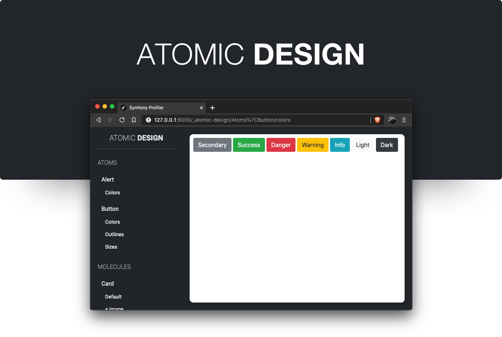

<h1 align="center">
    
    <br />
    <a href="./LICENSE.md" title="Licence MIT">
        
    </a>
    <a href="https://packagist.org/packages/qmachard/atomic-design-bundle" title="Packagist">
        
    </a>
    <a href="https://packagist.org/packages/qmachard/atomic-design-bundle" title="PHP 7.3">
        
    </a>
    <a href="https://github.com/qmachard/atomic-design-bundle/actions/workflows/tests.yml" title="Tests">
        
    </a>
    <a href="https://discord.com/invite/TzyhKGFRKM" title="Discord">
        
    </a>
</h1>

Atomic Design is a StoryBook like bundle made for Symfony.

🪄 Check out the demo : https://github.com/qmachard/atomic-design-demo-symfony

🎥 See the talk of this subject during AFUP Day 2021 (FR) : https://www.youtube.com/watch?v=QaK1sKtaafM

Installation
------------

Atomic Design requires PHP 7.3 or higher and Symfony 4.4 or higher.

Run the following command to install it in your application:

```bash
$ composer require --dev qmachard/atomic-design-bundle
```

Read the [Documentation](src/Resources/doc/index.rst) to configure this bundle.

Documentation
-------------

Read [Documentation](src/Resources/doc/index.rst) for manual installation and create your first component.

You need help ? [Checkout the Discord](https://discord.com/invite/TzyhKGFRKM)

Contributing
------------

Read the [Contributing Guide](CONTRIBUTING.md) and feel free to open a pull-request! 🍻

Licence
-------

This software is publishing under the [MIT License](LICENSE.md)

Authors
-------

Atomic Design was originally created with heart by [Quentin Machard](https://twitter.com/quentinmachard).
